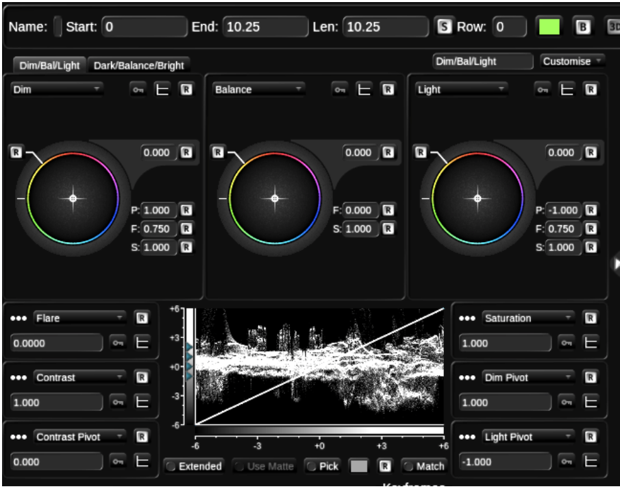
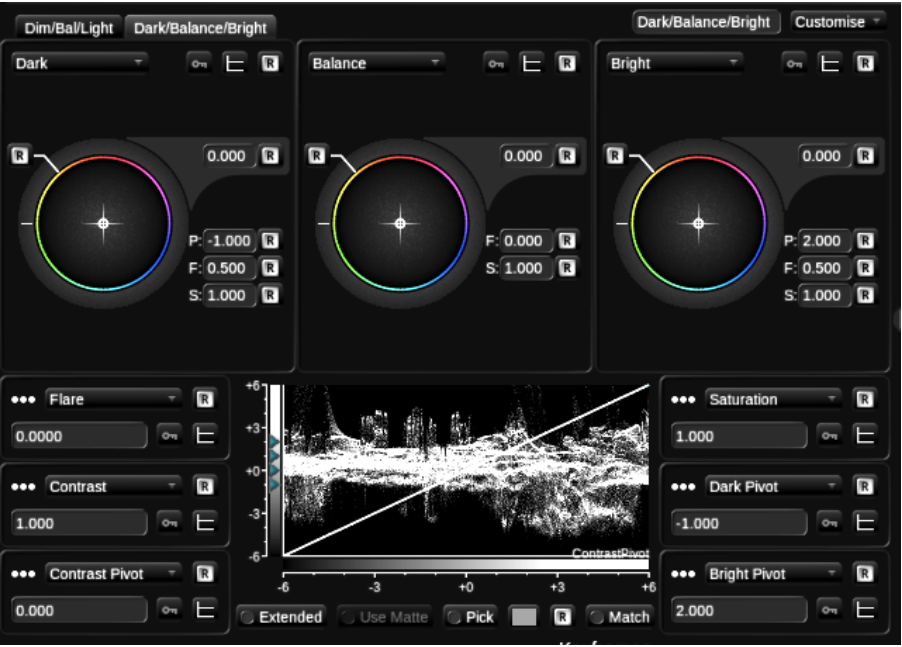
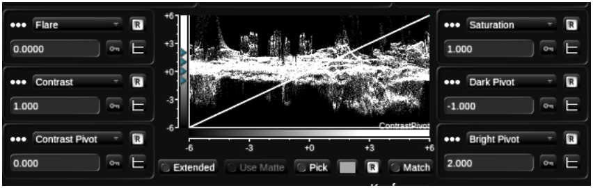
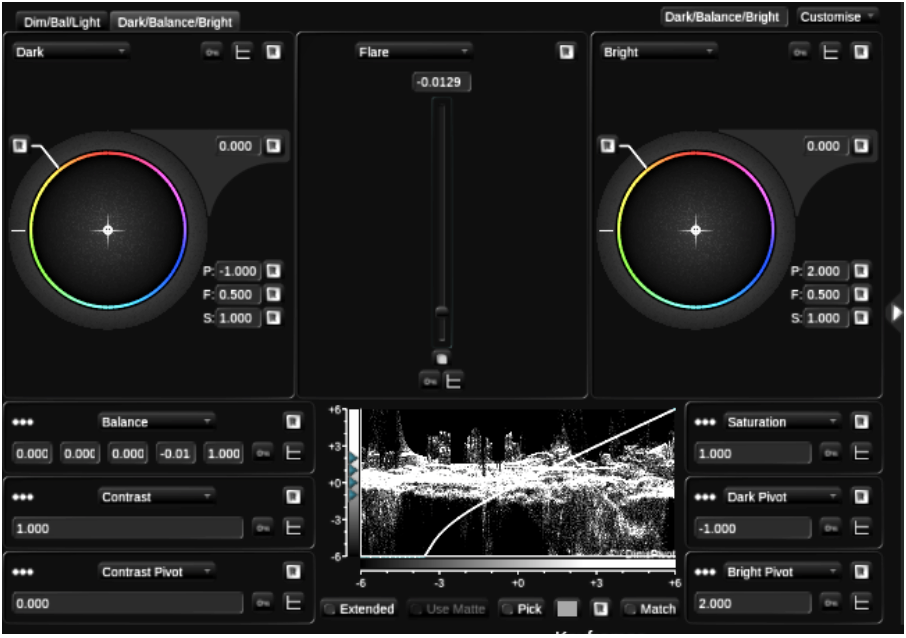
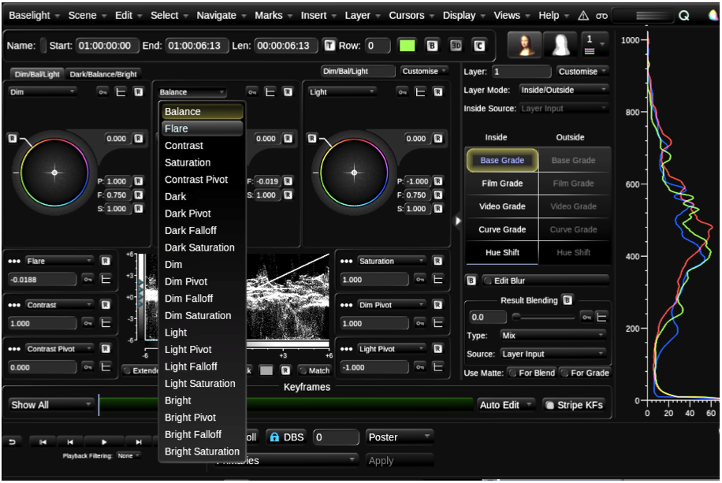
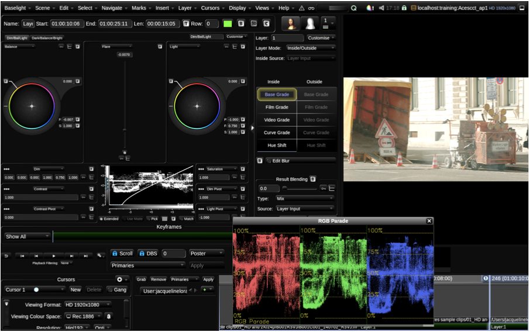

# Overview.... 47

Baselight v5 Training Manual

This Section builds on the discussion of Base Grade from the previous Chapter:

* Balance
* Flare
* Saturation in Base Grade

  Overview

  When you look at Base Grade you see that it consists of two sets of tabs.

Baselight v5 Training Manual

Image 60. Dim/Bal/Light tab.

Baselight v5 Training Manual

The Balance control is repeated twice in the UI. If you drag the colour wheel towards red you see that the same value is shown on both tabs. The idea is that you have access to the Balance control irrespective of the tab you are using. However, if you don’t feel you need the extra access you can of course choose another grading option.

So far, we have touched upon a few characteristics of Base Grade. We have mentioned that you can define zones in the image. You can for example, define which values should be considered Brights and Lights. Similarly, you can choose which values are Darks and Dims. All of these are definable via the pivots. The pivots can be adjusted manually by dragging the small green triangles or typing a value into the Pivot menus.

Image 62. Luma wave form and the adjustable pivot indicators.

There are also some other very useful functions that are not available in the other grading tools. One new operation is Flare. Flare lets you choose where the blacks will sit in an image.

Baselight v5 Training Manual

Image 63. One of the Balance menus changed to Flare.

1. 1  In the Aces scene move to the end of the timeline. Open FLUX Manage and drop in two versions of the following shot to the timeline ProRes sample clips/02\_3.2K/A006C00215124\_R3VJ.mov
2. 2  Add a layer to the first instance of new shot and select Base Grade.
3. 3  Change one of the Balance Menus to Flare from the drop-down menu.

Baselight v5 Training Manual

Image 64. One of the Balance menus changed to Flare.

4 Reduce the value of the flare to around -0.0070.

If you look at the image you will see that the black areas become darker.

The behaviour of the flare is also to pin the darker areas of an image to a certain value. This weighting means you can make a change to the exposure with the Balance Control – but keeping the dark areas intact.

1. 5  Now go to the Balance Control and increase the Exposure level. You will see that the darker areas remain dark.

   You can also refer to the RGB parade to view the behaviour of the image.

2. 6  Go to the Views Menu and Choose RGB Parade. If you keep the flare pushed down to -0.0070 – you

   will see that as you change the level of Exposure in Balance the dark areas look weighted.

3. 7  Now that you have learnt roughly what is happening between the Balance and Flare control – reset them.
4. 8  When you have finished experimenting with the Balance and Flare control close the RGB parade by pressing the ‘x’ in the corner of the window.

Baselight v5 Training Manual

Image 65. Baselight interface with the RGB Parade open.

Now let’s also look at saturation. Remember we said that the Base grade works in a perceptual colour space. Let’s see how this works with saturation.

1. 9  On the first shot in the Base Grade that you have added set the saturation to 2.00.
2. 10  Now on the second instance of the shot add a layer with either a Film Grade or Video Grade. Set the saturation to 2.00. Compare between the two results. The result of the Saturation in the Base Grade will probably appear more natural.

   Remember this exercise is just pointing out some of the differences between the functions and behaviour of the tools. There is no right or wrong answer in terms of which you decide to use for your work.

