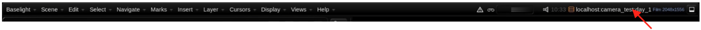
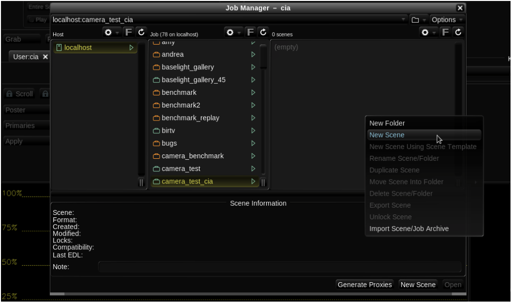
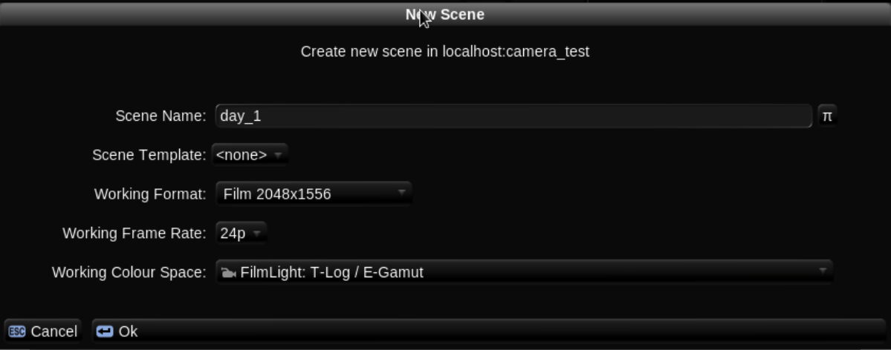
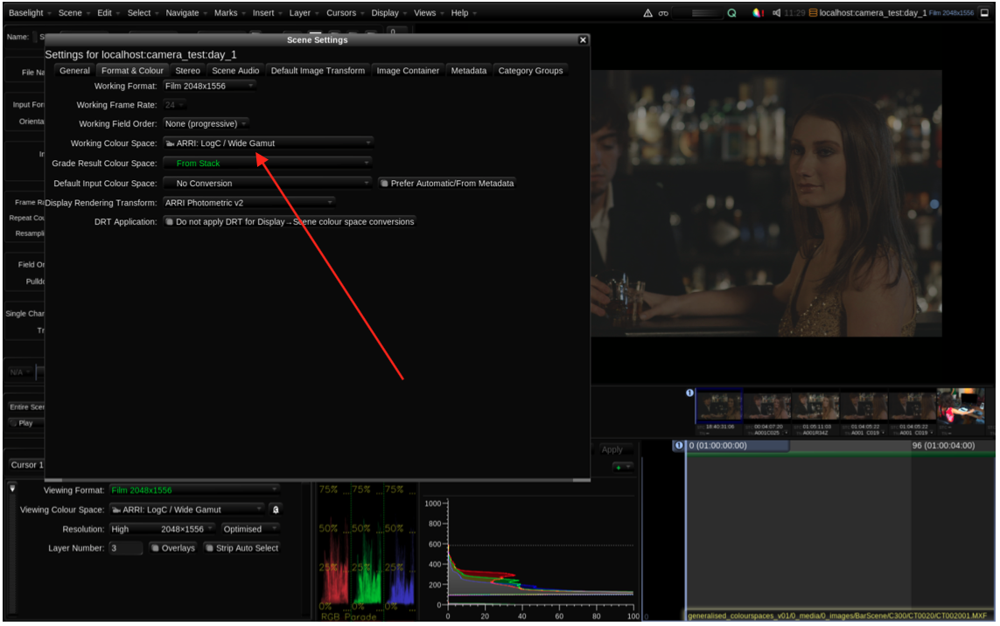
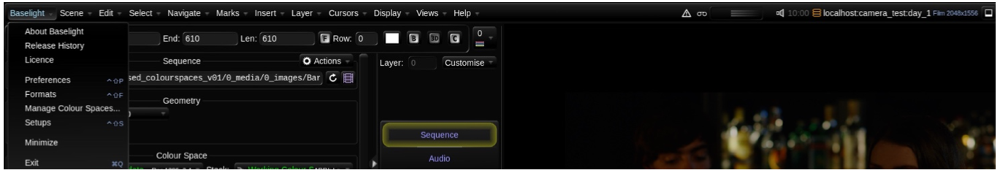
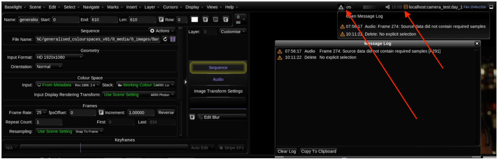

# Understanding the UI

  
Baselight User Interface

This section uses the Bar Scene images provided in:

generalised\_colourspaces\_v01/0\_media/0\_images/BarScene

Understanding the UI

This chapter will help you further understand the Baselight interface. We base the teaching around the scene you created in the previous sections; however, the information will relate equally if you drop any material into a scene. You will also be introduced to Caching, Marks, Strips and Stacks.

1. From the Job Manager, double click on the camera\_test scene that you created in the first section. You will see the name of the scene in the top right of the user interface.

  
p.p1 {margin: 0.0px 0.0px 0.0px 0.0px; font: 11.0px Calibri; color: \#000000}  
span.s1 {font: 11.0px Helvetica}  

If you wish to create a new scene with your own images you can do so from the Scene Column of the Job Manager. As in the first section you would use the actions button and choose New Scene.


  
p.p1 {margin: 0.0px 0.0px 0.0px 0.0px; font: 11.0px Calibri; color: \#000000}  

Remember when you create a new scene the software will prompt you for a working format \(a base resolution\), a Working Colour Space and a working frame rate.


  
p.p1 {margin: 0.0px 0.0px 0.0px 0.0px; font: 11.0px Calibri; color: \#000000}  

Remember the scene’s Working Colour Space can be likened to how much room you have available to you when you access available colour. In a small Colour Space, you only have so much room. Imagine a painter’s palette: you need to have a palette that can paint all the colours the camera can produce, as well as all the colours the audience’s intended display can produce. With a smaller Colour Space you may not have access to all of these colours so it is important to determine the correct Colour Spaces.

The Working Colour Space has no effect on the colour of an image before you start grading, irrespective of the Colour Space you choose. It will not affect how your picture physically looks before you start grading.

  
p.p1 {margin: 0.0px 0.0px 0.0px 0.0px; font: 11.0px Calibri; color: \#000000}  
span.s1 {font: 11.0px 'Arial Unicode MS'}  

However, if you start grading and then change your Colour Space the grade would be changed. Never change the Working Colour Space after you begin to grade.

3 If you are creating a new scene, you also need to go to the Views menu and open FLUX Manage and insert a few clips.

  
p.p1 {margin: 0.0px 0.0px 0.0px 0.0px; font: 11.0px Calibri; color: \#000000}  
span.s1 {font: 11.0px Symbol}  

We have showed you the three important user interface areas where you set colour spaces:

• Working Colour Space when you create a scene.

• Input Colour Space when you drop your clips into a timeline. If you set the Input Colour Space as Automatic or From Metadata, Baselight will decide on the correct colour space of the clip.

• The Viewing Colour Space, which must always match your viewing device.


  
p.p1 {margin: 0.0px 0.0px 0.0px 0.0px; font: 11.0px Calibri; color: \#000000}  

Also, please note if you forgot which colour space you chose in the previous section you can double check this by opening the Scene Settings window from the Views menu and selecting the Format & Colour tab.


You will now start to explore some of Baselight’s menus.

The first menu at the top of the user interface is the Baselight menu. This menu contains a number of useful sub menus, one of which is ‘About Baselight’ where you can view which version of the software is installed.

If you ever have to contact Baselight Support for assistance, the first question they will ask you is what version are you using, so don’t forget where to look.

Other useful options are the Preferences and Formats menus. Preferences allow you to set things such as the size of the font text on the Baselight interface or whether you want to be able to drag and drop clips to different positions in the timeline.

Note that Preferences are ‘per-user’ so if you log into the Baselight system under a different user name, you may get a different set of preferences.

The Formats Window lets you create new resolution templates for Baselight. Let’s say you have some media with a resolution of 1828x988, but you don’t see this resolution in any of the Baselight’s default formats. Baselight will use a basic ‘fit-width’ mapping for formats which are not defined in the existing formats list.

The menus that follow the Baselight menu provide access to the sub-menus for all the main functions in the system. A useful one to open is the Help menu as it has options to open documents like the Baselight Keyboard Shortcuts and Blackboard Button Reference.

Image 71. Message Log window. The large arrow points to the message log indicator; the smaller arrow points to the playback/caching indicators.

Now look towards the upper right of the interface. You can see a small triangle symbol with an exclamation mark. Click the triangle and it will open the Message Log. Here Baselight lists errors or other useful information that relate to the timeline.

Image 72. Top right corner of the menu bar.

The next icon looks like three stripes . If you are not playing the timeline, these stripes are grey. If you press play \(press the Spacebar on your keyboard, or use the play controls on your Slate or Blackboard\), you will notice that they probably become green.

These three bars are called the Playback/Caching indicators.

The three bars show when the system is reading images, processing images and caching images. They can also act as a general indicator of how well your system is able to play back image frames from the timeline.

Let’s look at these bars in more detail.

The top bar graphs the system’s reading of images from disk. Hopefully when you press play, this bar is green. Green indicates that your images are being read from disk at real-time and will probably be playing back at the frame rate that you set when you first created the scene.

If the bar is red, then it’s likely that your images are not playing back in real-time. To check the playback speed, press F on your keyboard and you will see a playback indicator in the top left of the image area.

The camera\_test scene that you created in Section 1 was set to 24fps. So, if you press F on the keyboard, you ideally see a value of 24 frames per second. However, keep in mind if you are running Baselight STUDENT that the reliability of your playback will depend on your machine configuration, which may not have a fast image volume to read from if it is a laptop.

The middle bar graphs the system’s processing of images. If you have a “heavy” effect such as a Temporal Degrain, Baselight will have to perform a lot of calculation before the system can play the rendered result back. In this case, you’ll see a red bar until the processing is completed.

The final bar graphs the system’s writing of rendered images to the local disk cache.  
 Caching may be necessary depending on the operations you are using in the timeline, the size of your

images and of course due to the limitations of your hardware configuration.

If for instance you added a filter that required a lot of processing such as a Temporal Degrain, or you were trying to review a large EXR file, the system will need to work really hard to play the image back in real- time. Some systems simply don’t have enough power.

You could of course render your work and then reimport it, but, more efficiently, Baselight provides you with the ability to collapse all of your processes into a single file and play back that file from disk. We call this caching. The good thing is that the process is seamless and all you need to do is activate it and, of course, understand exactly how it works. Remember if you were prepping for or running a camera test session, smooth playback is essential.

As this chapter continues we will show you how to activate caching. Once you have learnt the principles of how caching works please disable this setting \(via the Scene Settings View\).

