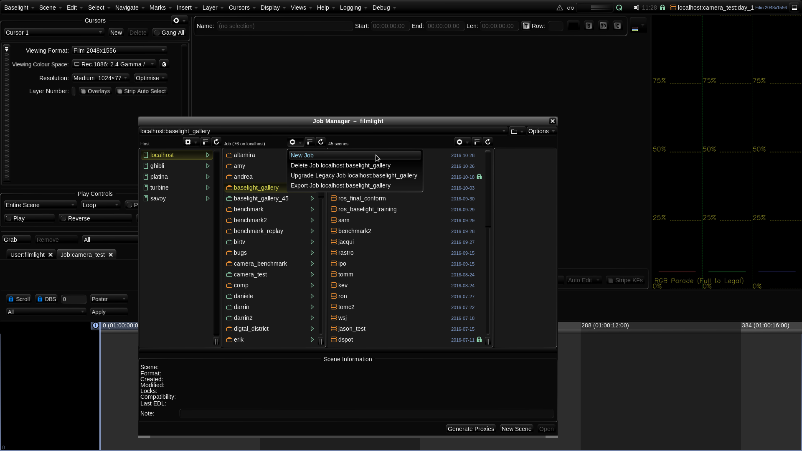

# Creating a New Project

Baselight v5 Training Manual

Getting Started

Before we begin, whilst the software is usable without them, if you wish to utilize the full capability of the Baselight system you will need a Three Button Mouse and a Full Keyboard with the Numeric Keypad. When these are needed it will be highlighted in the text but if you want to have full control it is recommended that you have both of these tools from this point.

This section uses the Bar Scene images provided in:

generalised\_colourspaces\_v01/0\_media/0\_images/BarScene

## Creating a New Project

Baselight v5 Training Manual

In this chapter you will learn about formats, creating projects, assembling a timeline, importing footage and learn how and why you need to choose appropriate Working Colour Spaces, Input Colour Spaces and Viewing Colour Spaces.

The aim of this section is for you to be able to set up a scene for a camera test, as well as run the camera test session with the DOP \(director of photography\) and the director.

1 Open Baselight.  
Baselight v5 Training Manual ![] ) Baselight icon on your desktop or in the Applications &gt; Baselight

NEW TEST :  

folder, or, if on a Linux machine, open a terminal, type baselight and then press Enter.

The software will open with the Job Manager already visible. The Job Manager is where you can set up a ‘job’ \(a collection of Scenes\) and a ‘scene’ \(in Baselight, a ‘scene’ is a collection of shots — for example, rushes from a day’s shoot or a conformed commercial or drama – it does not necessarily relate to a scene in a script\). You can also access the Job Manager from the Scene menu at the top of the UI or by pressing Ctrl+J on the keyboard \(Cmd+J on Linux\).

Image 01. New Job Window - Baselight launches with the Job Manager already open.

In the Job Manager, you see three columns.

The first column on the left-hand side is labeled ‘Host’. This indicates where the job database is located, so this could be the machine you are working on, or if you are working in a larger facility, it could also be another Baselight system or a server.

The second column moving to the right \(middle column\) is where you can create a new ‘job’: place the arrow/mouse on this column and right-click, which will give you the option to create a New Job \(or place the mouse on the Actions menu button and click it\). Again, the job is like a project where you may keep various scenes.

The third column, on the far right-hand side, displays the Scenes that you have created. These will each hold collections of shots.

2 In the Job Manager – create a job called “camera\_test”. Click the actions button in the second column and choose ‘New Job’. Note that once the new job is created, the software focuses on the far- right column. Now click the Actions menu button in the third column, where you can create a ‘scene’ within the job.

Image 02. New Scene Window - when right-clicking on the third column, a new menu opens giving the option to select ‘New Scene’ \(highlighted in blue\).

The ‘scene’ is where we set the various variables that relate to a project. The ‘job’ is really just the name of the project. The ‘job’ does not contain the variables relating to how the scene is set up. It’s the ‘scene’ that holds the important information about how the project is set up. When creating a ‘scene’ we must choose a: • Working Format \(a Resolution\) • Working Colour Space • Working Frame Rate

But the software will prompt you.

Image 03. The New Scene window. This is where you choose a\) Working Format, b\) Working Colour Space and c\) Working Frame Rate. See the definitions at the end of this chapter for more information.

3 Now that you have created a job folder, you can create a ‘scene’. You should call this “day\_1”. Note that the software is now prompting you for certain information. A general rule when setting up a scene, is to choose a wide Working Colour Space such as ACES or ARRI Log C. The Colour Space that you choose will generally not affect how the image looks but it may affect how some of the tools in Baselight react. Some tools, such as the Base Grade, have their own internal colour space so will not be affected by the Working Colour Space. We will look at Base Grade and Colour Spaces in more detail in a later section. If you are looking for a Colour Space that can be used for most situations and you are using Baselight V5, then you should use FilmLight T-Log E Gamut \(Truelight Log Extended Gamut\). If you are not using version 5, just choose a large Colour Space and if you need to understand why, take a quick look at this chromaticity diagram below.

Image 04. Chromaticity Diagram.

To start to understand the significance of colour spaces look at this diagram. Notice that Rec.709 occupies a much smaller area than all of the other Colour Spaces. This is why we would not recommend Rec.709 as a Working Colour Space unless your intended project deliverables will be limited to Rec.709. A wider working space encompasses the native Colour Space of most cameras; thus, when we’re grading we’re assured we’re not losing any fidelity.

Image 05. Menu with various Working Colour Spaces.

Let’s return to your setup. 4 In the new scene window select the Working Colour Space from the drop-down menu. 5 Choose FilmLight T-Log or ARRI Log C Wide Gamut.

6 Set the Working Format \(resolution\) to Film HD 1920x1080 7 Set the Working Frame Rate to 24fps. 8 Close the Job Manager window by selecting the x icon at the top right or by pressing Ctrl+J or Cmd+J on the keyboard. Once the scene is created, if you look at the top right-hand corner of the UI you will see the name of the scene and its resolution.

Image 06. Scene name and resolution.

