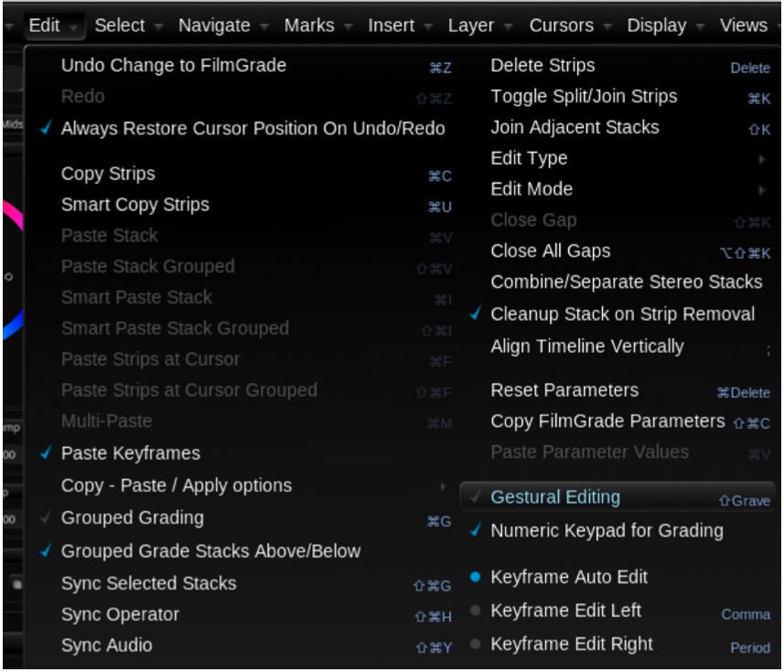

# Accessing the Printer Light Functionality

Slate and Blackboard

Printer lights will become active on the Slate or Blackboard if you have reconfigured the user interface to use Overall Exp. Bump.

Keyboard

If you wish to access the printer light functionality on a laptop, please connect an external keyboard. The

* and – keys on the numeric keypad of the external keyboard will let you increase and decrease brightness.

If you don’t have access to an external keyboard, another useful option is to activate gestural editing.

