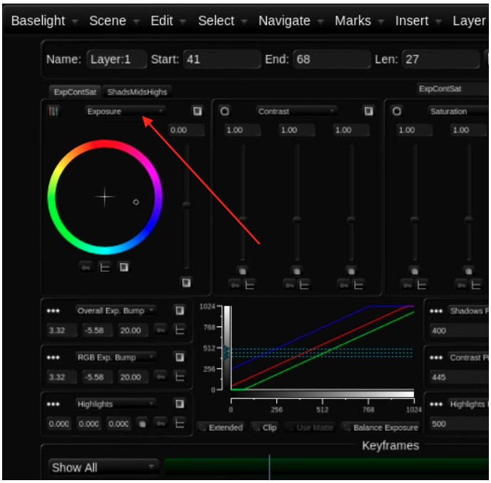
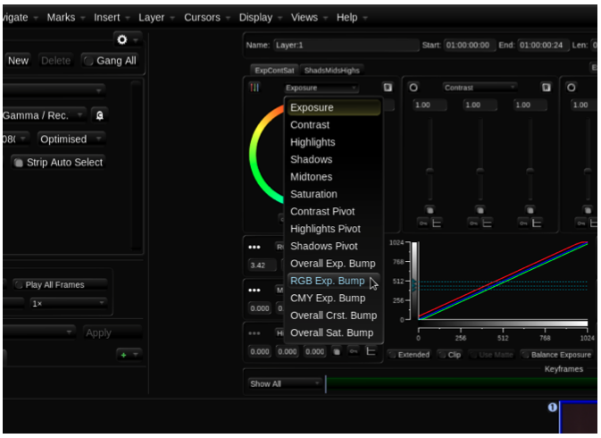
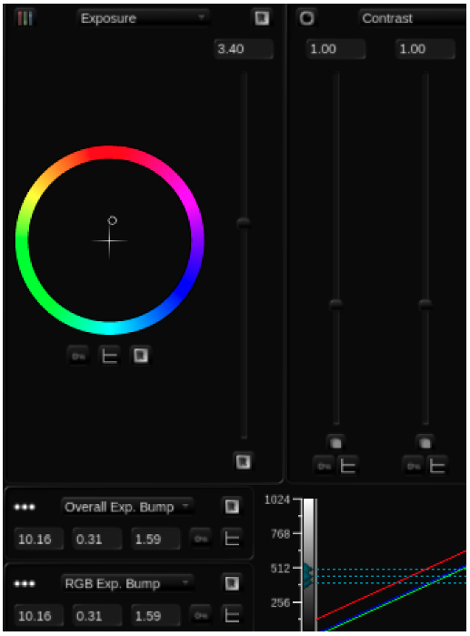

# Configuring Film Grade to Work in Printer Lights

Baselight v5 Training Manual

All tools in Baselight are configurable. For the moment, you will reconfigure only the Exposure settings for the Film Grade.

1 Click the drop-down menu arrow below the Exposure parameters. You will see a menu of options.

Baselight v5 Training Manual

Image 26. Film Grade parameters. An upside-down arrow means you can access a drop-down menu.

Image 27. Open drop-down menu.

2.  Choose Overall Exp Bump. This allows you to control brightness either pressing the appropriate button on the Blackboard or Slate, or by pressing + or – if you have a keyboard with a numeric

keypad.

3.  In the field below what is now Overall Exp Bump, click the drop-down menu arrow and select RGB

Exp Bump. Make sure your interface is set up to match the settings displayed in the image below.

Image 28. Film Grade reconfigured with Overall Exposure Bump and RGB Exposure Bumps selected below the main Exposure controls

