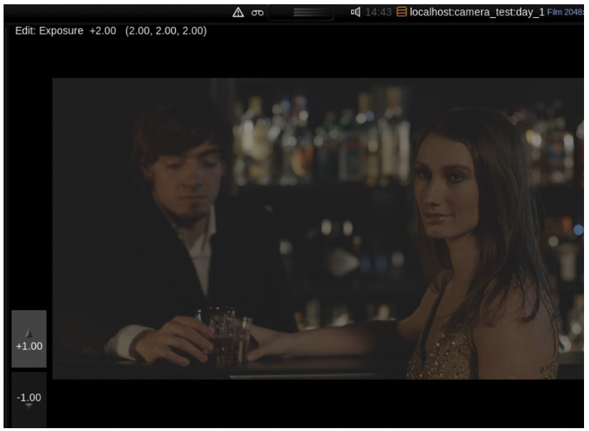

# Gestural Editing

1. To turn on gestural editing, go to the Edit Menu and choose **Gestural Editing**.

Once gestural editing is active, if the Film Grade controls are selected and you move your cursor to the image area, grading controls will be available to you on the display screen.

Let’s recap. You have applied a layer to each of your shots. \(If you haven’t applied a Layer 1 to each shot please move through the timeline and do this now\). You have selected a Film Grade and you have started to explore the Exposure control. You have also seen that the Film Grade is configurable, with options available like printer lights and gestural editing. Hopefully you have attached an external keyboard and experimented with printer lights.

If you are working only on a laptop and do not have access to an external keyboard you may have chosen to work not with printer lights but rather with Gestural Editing. Whichever tool you decide to use, the aim of this exercise is the same – the brightness of the four shots must match.

You may be wondering why you are working only with exposure. You will have noticed no doubt that the Film Grade consists of many more options. It does indeed. In later chapters, we will return to them. However, matching brightness is one of the fundamentals of matching shots, and for this reason you will now complete the main task of this exercise, which is to simply move through the timeline and make sure that the brightness of each sequence is roughly equal.

2. Move through the timeline and for each shot change adjust the Exposure setting so that the shots match.

In this exercise, you are matching the shots by eye. However, to help with accuracy you can also start to look at the histogram, which appears in Baselight by default. We don’t provide a full explanation in this section, but it’s a useful tool to refer to when working with image.

2 Move through the timeline and for each shot change adjust the Exposure setting so that the shots match.

In this exercise, you are matching the shots by eye. However, to help with accuracy you can also start to look at the histogram, which appears in Baselight by default. We don’t provide a full explanation in this section, but it’s a useful tool to refer to when working with image.  
****

