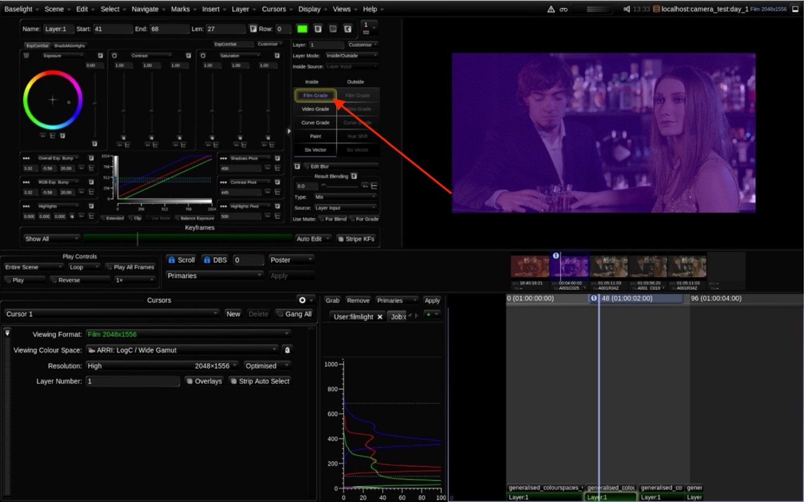
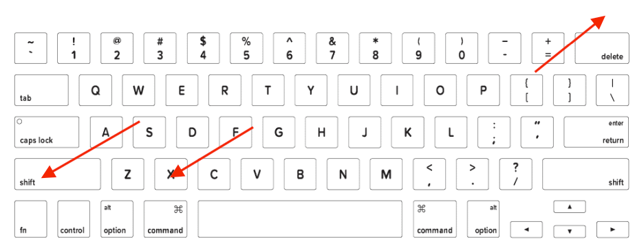
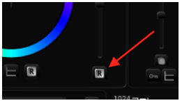

# Let’s Return to the Grading Suite

In a camera test, a Director of Photography \(DOP\) or the Director often tells a colourist to make the image brighter or darker – warmer or colder. You can answer all of these requests easily with the Exposure control in Film Grade.

1  Make the first shot warmer. To do this move the colour wheel or trackball in the Exposure control toward red.

2  In the next shot, you can make the image cooler by moving the colour wheel toward blue.

Image 22. The Exposure colour wheel pushed towards blue. We can see that changes to the Film Grade have been made even without looking at the image, because the words Film Grade are displayed in purple.

So, this is all correct – but it’s not exactly subtle.

Remember subtlety in a camera test is essential. Professionals such as Directors of Photography look at images continually. Their eyes are sharp. A frequent scenario in a camera test is that you would be asked to add a couple of points of a colour or a couple of points of brightness. You must understand how to be accurate. For this reason, it is useful to understand how to reconfigure the software to work with printer lights/exposure bumps.

3 Please reset each Film Grade that you have changed. To do this in Baselight STUDENT, go to each shot and press **Cmd+Fn+Backspace** or **Ctrl+Fn+Backspace** \(The reset command will reset the tool that is selected\).

Image 23. Mac keyboard.

If you are on Slate or Blackboard, press the reset buttons in the Film Grade. There are also R symbols available in the user interface. If you select one of the R symbols adjacent to a parameter that parameter will be reset.

Image 24. Reset control.

Baselight v5 Training Manual

Configuring the Film Grade to work with printer lights is simple. How you access the printer lights/exposure bumps will depend on if you are working in Baselight STUDENT or if you have a Blackboard or Slate available to you.

If you are working in Baselight STUDENT and you wish to experiment with exposure bumps/printer lights, please attach an external keyboard so that you have a full numeric keypad available to you.

Image 25. A student working on a MacBook Pro with an external keyboard attached.

