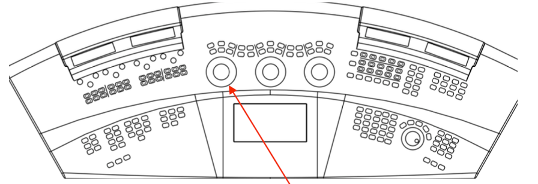

# Why choose Film Grade?

Many colourists prefer to start with Base Grade these days as it provides a more natural set of grading controls. However, as it is a more complex tool we will cover it later on, so to keep things simple at the start we will use Film Grade for this example.

There are many reasons to choose Film Grade, but one very simple reason is that it allows you to work in printer lights \(sometimes also called printer points or exposure bumps\). This means you can be very accurate in dealing with brightness changes or the DOP’s request to add or subtract a couple of points of red. You cannot do this in the Video Grade.

Let’s spend a moment getting a general feel of the Exposure parameter before we reconfigure.

Image 20. The ‘Film Grade’ colour wheel. The large red arrow points towards the Exposure \(Brightness\) slider. The small arrow points to the colour wheel, which allows you to change the overall hue of an image.

1 Move to the first shot in the timeline \(**Alt+Z** or **X** will move you backwards or forwards to the middle of a shot or you can use the transport controls on the Slate or Blackboard\). Make sure that you apply a layer to each of the shots. To apply a layer, press **P** on the keyboard or choose Layer 1 from the Blackboard or Slate. 

The Film Grade’s **Exposure** control lets you push an overall colour cast into the image via the colour wheel. You can also decrease a colour cast. Alternatively, if you want to change brightness, you can drag the slider that sits to the right of the colour wheel.

2  If you are working on Baselight STUDENT, drag the slider to increase or decrease its value. To alter the overall colour of the image, drag the dot in the centre of the colour wheel.

3  If you have a Slate or Blackboard use the ring on the track ball to change the Exposure value and the ball to change colour.

Image 21. FilmLight Blackboard with the arrow pointing towards the grading trackballs.

If you have the histogram or any of the scopes displayed, these tools will reflect the changes you are making to the image.

