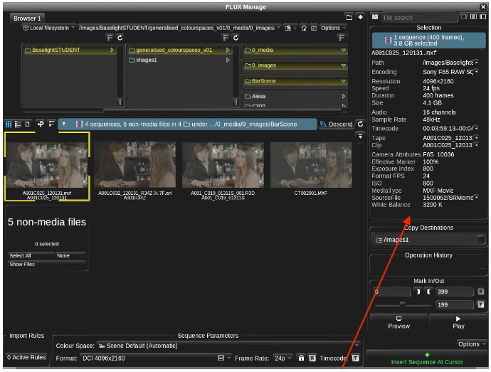
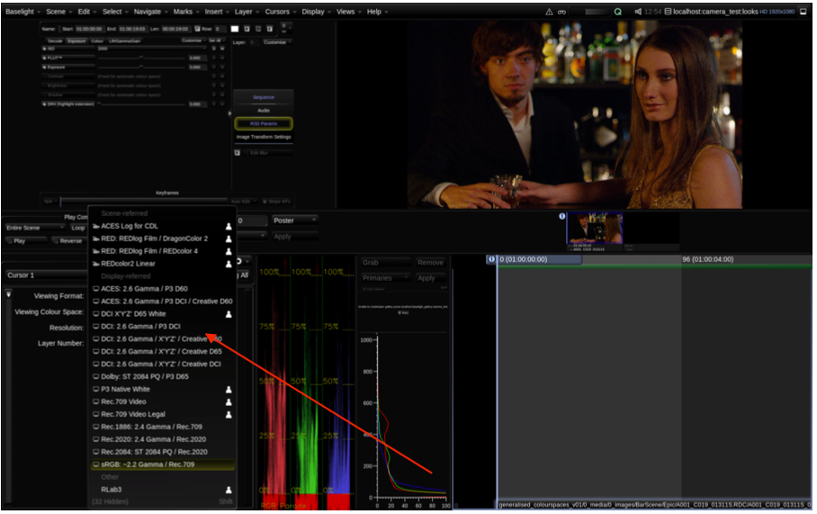
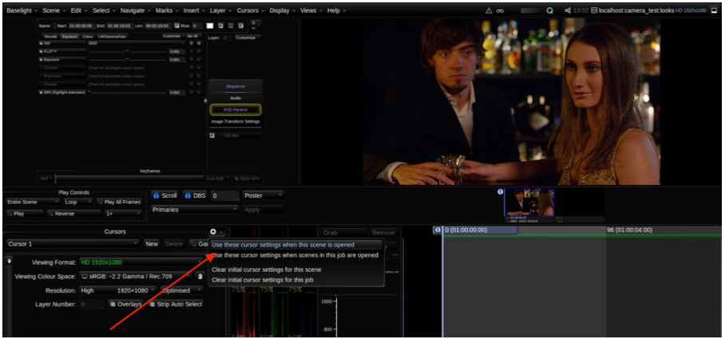
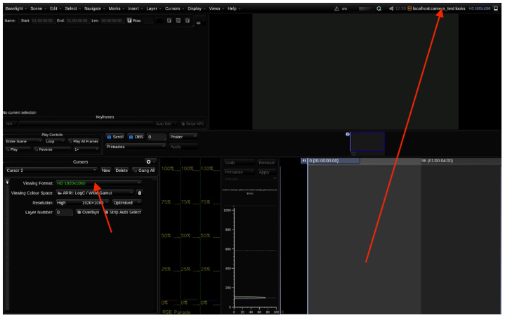
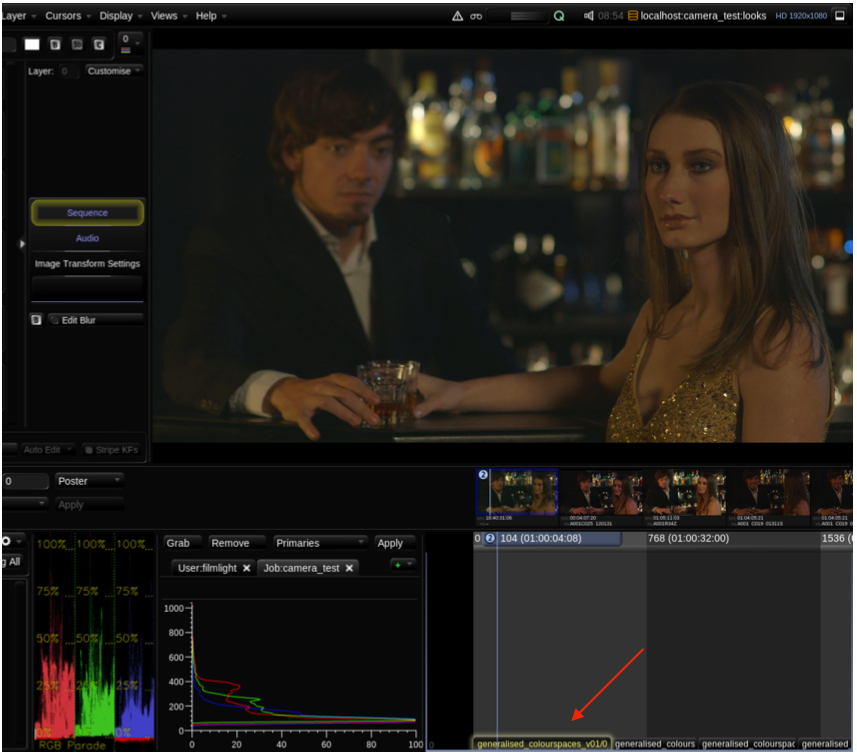

# Setting Up a Basic Primary Grade ..... 24

Baselight v5 Training Manual

This section uses the Bar Scene images provided in:

generalised\_colourspaces\_v01/0\_media/0\_images/BarScene

This section will teach you how to set up a primary grade. We will look at Film Grade and Video Grade. We will also cover shapes and set up a basic ellipse shape, which is often used to apply a vignette effect to a shot.

1 Create a new scene and call it “Looks”. Set the working format to HD 1920x1080 and choose a wide colour space such as Arri Log C Wide Gamut or ACES. The frame rate for the scene should match the material you are importing.

If you do not remember how to create a new scene you can return to the instructions provided in the first section.

Also, if you don’t know the frame rate of your material, you can go to the Views menu and open FLUX Manage.

When you navigate to the material you want to use, you can see the frame rate displayed in the browser window. This information is taken from the metadata of the selected file.

Baselight v5 Training Manual

When you have created your scene, make sure that you are viewing your images in the correct colour space. The Viewing Colour Space you set must always match your display device. Look back at the previous section on this if you can’t remember where you set this option.

Baselight v5 Training Manual

So, for example, if I needed to create a UHDTV job and I had a capable monitor, the monitor may need to be set to Rec2020. In Baselight, I would also have to choose a Rec 2020 Viewing Colour Space to match the monitor.

\(For readers unsure of the significance of Rec 2020, it is a standard that defines various aspects of Ultra High Definition television.\)

If I was working on a feature film in a grading theatre and the projector was set to DCI-P3, then I would make sure that my Viewing Colour Space in Baselight was also set to match the P3 Colour Space of the projector.

\(For readers who are unsure of what the P3 colour space is, it’s an RGB colour space that was designed for use on digital cinema projectors.\)

Baselight v5 Training Manual

To save the Viewing Colour Space, select the Actions button \(located in the Cursors Section of the interface\) and choose either ‘Use these cursor settings when this scene is opened’, or ‘Use these cursor settings when scenes in this job are opened’.

It’s probably advisable to always save your Colour Space. If you were acting as an assistant for a colourist and the correct Colour Space was not set before they started work, they would be mightily unhappy.

In fact, always remember to check that the Viewing Colour Space is correct. Let’s say that one more time:

ALWAYS DOUBLE CHECK THAT YOUR VIEWING COLOUR SPACE MATCHES YOUR DISPLAY DEVICE.

Baselight v5 Training Manual

In the following example, as mentioned previously, we will use the bar scene images, but the instructions should apply to any sequence. Ideally you are feeling confident enough to experiment and will use your own material.

Your scene should be open. Remember even if your scene is empty we know if it is open by looking at the top right corner of the Baselight user interface where the resolution and name of a scene appears. Also, all scenes have a cursor – even empty scenes. Hopefully you haven’t forgotten that the vertical light blue line that you see in the timeline is called a cursor. You may want to think of it as a playhead.

Baselight v5 Training Manual

1. 2  Go to the Views menu and open the FLUX manage.
2. 3  Navigate to the shot you wish to use, or if you want to follow these set of instructions exactly navigate

   to and insert the clips from:

/images1/generalised\_colourspaces\_v01/0\_media/0\_images/BarScene/Epic

Baselight v5 Training Manual

Now let’s apply a primary grading layer \(Layer 1\).  
 4 Make sure the clip you want to grade is selected.

Baselight v5 Training Manual

1. 5  If you are using Baselight STUDENT, press P on the keyboard. If you are using Blackboard, press Layer1.
2. 6  Select the Video Grade.

