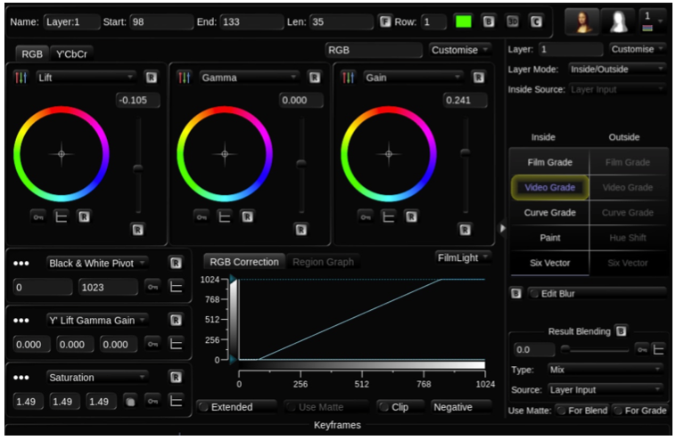
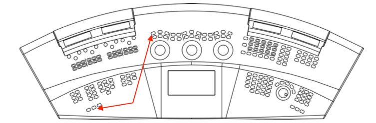
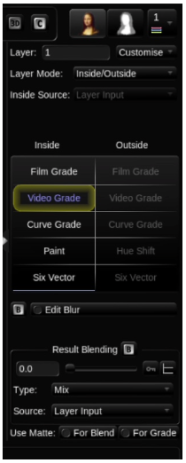
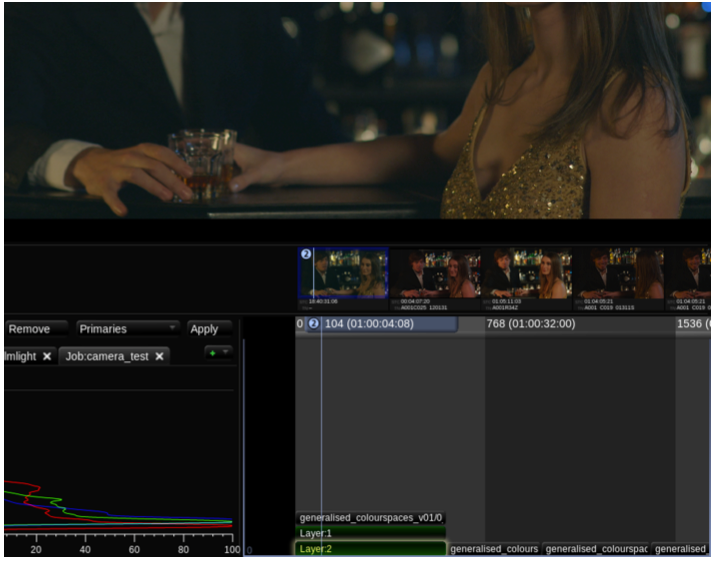

# Video Grade

Video Grade is a popular tool with commercials colourists as it allows them to quickly set contrast. You may hear people talking about this as adding “punch” to an image.

For those of you who are new to colour grading, lift controls the shadow areas of the image, gamma, the midtones, and gain, the highlights.

1. As in the above image, move the lift control downwards and the gain up. The image immediately appears to have more contrast.

You will also notice that there are two separate tabs inside the Video Grade, RGB and Y’CbCr.

If you make the contrast change in the RGB tab the image will also start to look more saturated. If you do the same contrast change in the Y’CbCr tab you can affect the contrast without affecting saturation too much.

1. Reset the Video Grade: If you are using Baselight STUDENT, the shortcut for resetting all parameters is **Cmd+Fn+BackSpace**. If you are using a full Baselight system, use **Ctrl+Backspace** or **Ctrl+Reset** next to the grading ball on the left.

1. Now apply contrast in the Y’CbCr tab. Move lift down and gain upwards.  
2. Decide which look you prefer. If you preferred the effect of the contrast change in the RGB tab, press

Cmd+Z or Ctrl+Z until you return back that look.


It’s useful to note that in Baselight every change you make is saved in a database, so. you can always return back to what you were doing a few moments earlier.


Are you wondering why Layer 1’s list of operators doesn’t allow you to access the column marked Outside? This is because this layer does not contain any mattes.

Mattes are used in Baselight to define areas that will be treated separately – either with different grading and other image operators, or to composite areas of one image over another.

Mattes in Layer 1 are something you should really avoid. Technically, of course, you can add them. However, most users set an overall grade first. This is what colourists mean when they talk about setting up a primary.

In Baselight when users talk of primaries, they are generally referring to either Video Grade or Film Grade.

There are essentially four different ways to create a matte: using a keyer, drawing one or more geometric shapes, applying paint using a matte brush, or using an external image.

You will now add Layer 2, and inside you will add a shape.

1. If you are using Baselight STUDENT, make sure Layer 1 is selected and press P. This will add a new layer below Layer 1. If you are using a Slate or Blackboard panel, press the layer 2 button to add the new layer.
2. Don’t start grading yet as you first need to add a shape. Make sure Layer 2 is selected \(the strip for the selected layer is shown with a highlight in the timeline and the strip text turns yellow\) then press S. A shape strip will appear above Layer 2. If you are using Slate or Blackboard you can add a shape by pressing the Shape button in the stack manager area of keys.


For more guidance on grading with a control panel, you can find the Slate and Blackboard User Guides on the FilmLight web site.


It’s important to remember in Baselight that new layers append to the bottom of the timeline \(not the top as in some other systems\). So, the bottom of the stack is actually the end result of your grade.

Select the shape layer and make sure that ‘New Shape’ is selected \(also note that shortcut Q will toggle new shape on and off\).

1. Click on the New Curve Mode drop-down menu and choose Ellipse.
2. Move your cursor to the image area, click and drag outwards.
3. As you create your shape, you will have noticed that you no longer see the image area but rather the shape you have created.

