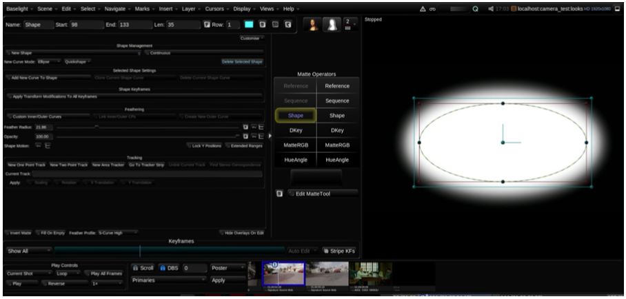
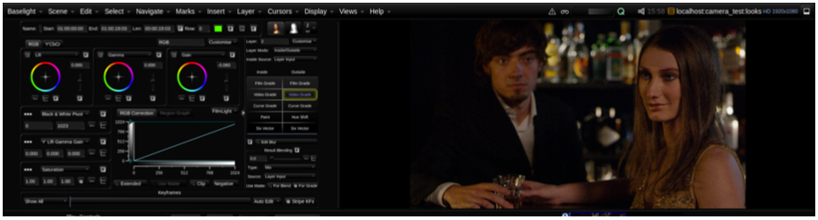
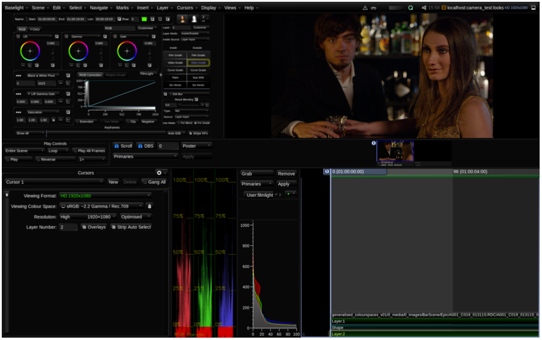
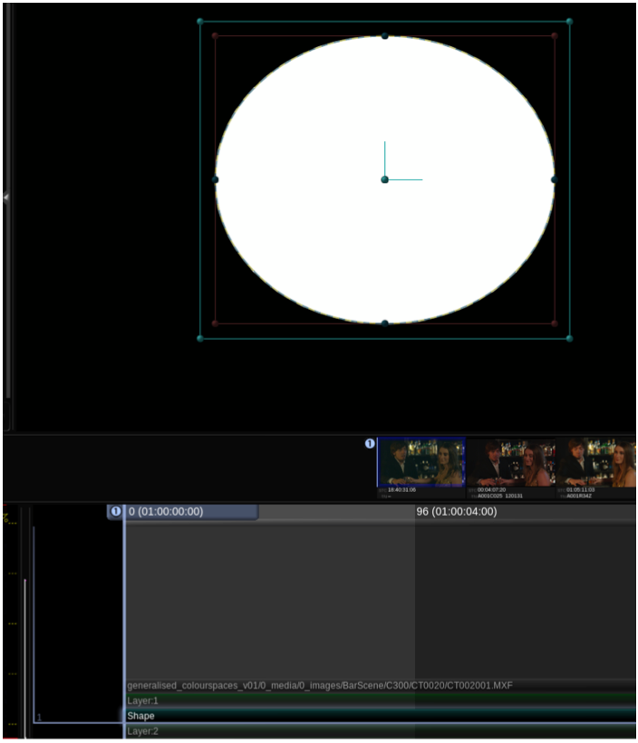

# Viewing Matte Channels and Images ...... 31

Baselight v5 Training Manual

If you look above the operator columns, you will see that there are two Mona Lisa icons , one in full colour and the other greyscale. When the full colour Mona Lisa is selected you are looking at an image as opposed to a matte. You haven’t noticed this yet because this is actually the default mode in Baselight. The greyscale Mona Lisa lets you view mattes.

When you add a shape, its strip is automatically selected and the greyscale Mona Lisa icon is enabled to display the layer matte. If, after you have created the ellipse, you switch between the two icons, you will notice that the display changes from image to shape. \(If this does not happen make sure Layer 2 is selected and press O on your keyboard to switch states.\)

Baselight users often use the terms Mattes, Mask, and Shapes to refer to the same thing. If you see or hear any of these terms all you need to remember is that an area has been defined in the image that restricts grading to inside and outside that area.

Baselight v5 Training Manual

Once you have created a shape in Layer 2, you can move it by grabbing the middle point of the shape overlay. If you are working on Slate or a Blackboard, the grading balls will allow you to move and expand the shape.

1  Now add softness to the shape by changing the Feather Radius.

2  Click on the full colour Mona Lisa icon to ensure that you see the image and that the grading tools

are active \(or press the shortcut O\). Because you have added a shape to Layer 2, you will have

Baselight v5 Training Manual

operators available for both inside and outside of the shape. We sometimes call this kind of layer a secondary because we’re grading only selected areas of the image, as opposed to the primary grade \(usually in Layer 1\), which affects the entire image.

3 Once the image is displayed \(as opposed to the shape\), select the Video Grade by clicking on its operator in the ‘Outside’ column and darken the areas outside of the ellipse by decreasing the lift and gain. By darkening the outside area of the shape, we are trying to draw the viewer’s eyes toward the women as opposed to extraneous background detail in the image.

Baselight v5 Training Manual

This basic trick of adding a ‘vignette’ by darkening or lightening an area is something that a colourist performs every day.

So hopefully this brief explanation has shown you how to assemble a very basic primary and secondary grade. Now experiment further. Add some more layers and shapes. Don’t be shy. In some of the sections that follow, we will teach you how to keyframe grades and also how to track shapes.

Baselight v5 Training Manual

Tips

* O is the shortcut to view mattes that have been added to a layer.
* Layers in a timeline are also referred to as a stack.

It is possible to move up and down the layers in the timeline using the up/down arrow keys on your keyboard. This is probably the easiest way of seeing what is happening in your layers. When you first try to use the arrow keys on your keyboard, you will notice a horizontal blue line. We call this the render cursor. This indicates what layer we are viewing in the stack. By default, if you don’t move the render cursor, it remains at the very bottom of the stack so you are viewing the last added layer.

