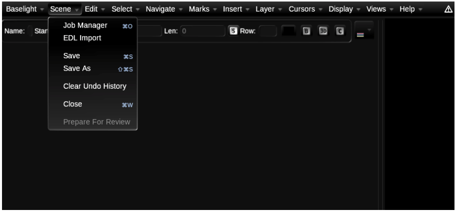

# Why does Baselight have so many different grading tools? ...... 35

Baselight v5 Training Manual

It’s probably safe to say that the most used grading operators in Baselight are Film Grade and Video Grade. However, in version 5, we also offer Base Grade.

The main thing to remember with Baselight is that you can use any or all of the operators in the same stack. You can use Film Grade with video material, and you can use Video Grade with film/log-encoded material. You can even use them both in the same layer. And, of course, you now have a third option, Base Grade.

Let’s give you a bit of history to the tools. In the early years, the main grading tool was Film Grade. It was designed for images scanned to Cineon Log Colour Space. This does not mean that you can't use the tool with video images — you can of course.

If you quickly look at Film Grade, you will see that it lets you work with exposure, contrast and saturation. You can also specify highlight and shadows values via two sets of pivots.

The first DI project to use Film Grade was Chicken Run way back in 2000.

Film Grade is fairly customizable and one of the main differences between Film Grade and Video Grade is that Film Grade can work in printer light units. We touched on how to set up your system to work with printer lights in earlier chapters. One method of doing so is via the Edit Menu which allows you to enable printer light bumps on the numeric keypad.

Baselight v5 Training Manual

After Film Grade came Video Grade.

Baselight v5 Training Manual

Video Grade has lift, gamma, and gain controls, along with saturation. In the past, the Video Grade was generally used for video or telecine style grading.

Video Grade has no printer light functionality. If you were to make a straight exposure change, you would move both lift and gain away from 0.

There is also no direct contrast control. In Video Grade, contrast is applied by reducing lift and increasing gain.

There are two modes in Video Grade, RBG and YCbCr. As you explore Video Grade, you will see that if you make a contrast change in the RGB mode by manipulating lift and gain, you may also experience a change in saturation. If you make a similar contrast adjustment in the YCbCR mode, you will see that there is less of an effect on saturation.

Whichever mode you choose to use is of course a simple question of taste. 1 Open the Job Manager from the Views Menu or the Scene Menu.

Baselight v5 Training Manual

2 The scenes that you are creating roughly have a similar tone curve. Please create three scenes each with the following working colour space

* ACEScct
* REDlog \(choose any variant you like\)
* ARRI Log C Wide Gamut

  Also, please ensure that you set an appropriate viewing colour space for each scene. So, for example, if you are on a laptop please set this to sRGB.

  It’s an absolute requirement of the Baselight Colour Management System that you always set your viewing colour space correctly and for this reason we will continue to remind you to so.

Baselight v5 Training Manual

\(By the way, when we talk about tone curves, we are referring an image’s distribution of shadows, midtones and highlights.\)

Baselight v5 Training Manual

As you create each scene, you will see the name of the open scene in the top right of the user interface. If you click on the name of the scene in the top right of the UI, you can jump between scenes.

Remember, each time you create a scene, it opens automatically with a cursor. Remember the cursor is analogous to the playhead on a video tape player – it allows you to playout any part of the timeline.

In previous chapters, you were working with just one cursor. Because you now have three scenes open concurrently, you now have 3 cursors available to you, one for each scene. Any open scene will have at least one cursor, and you can add additional cursors to any open scene. Multiple cursors within the same scene are useful for making quick comparisons.

Active cursors are tied to the number keys on your keyboard. As you have 3 cursors available, you can press 1, 2, and 3 on your keyboard in order to jump to each cursor. Selecting a cursor makes its parent scene active.


Baselight v5 Training Manual

Also, please note that if you have kept the Job Manager open as you create each scene, a lock will appear next to the name of the scene. The lock indicates that the scene is not writable by any other user because you have it open.


Baselight v5 Training Manual

Before you proceed make sure that the Job Manager is closed by clicking on the ‘x’ at the top left of the dialog.

