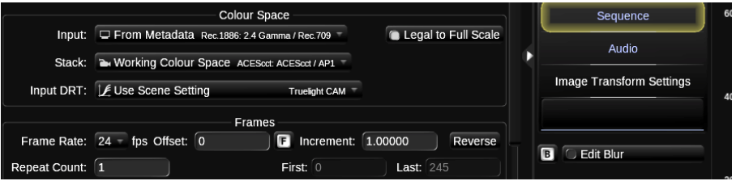
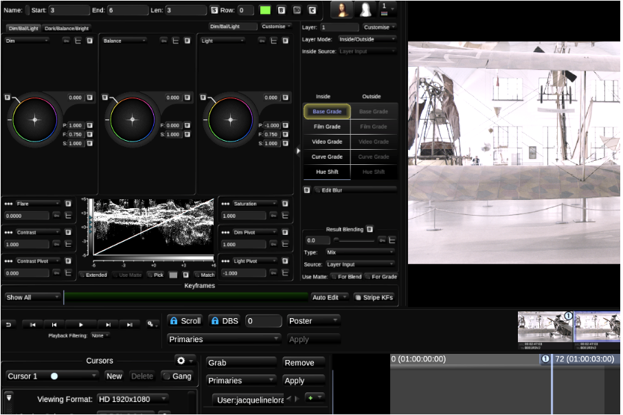
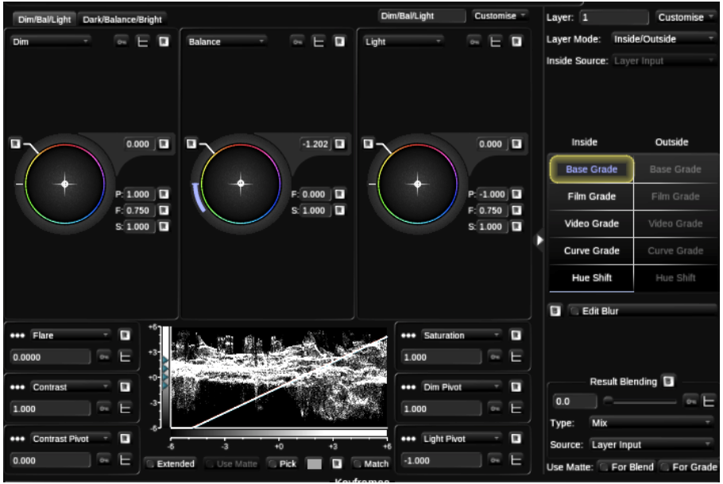
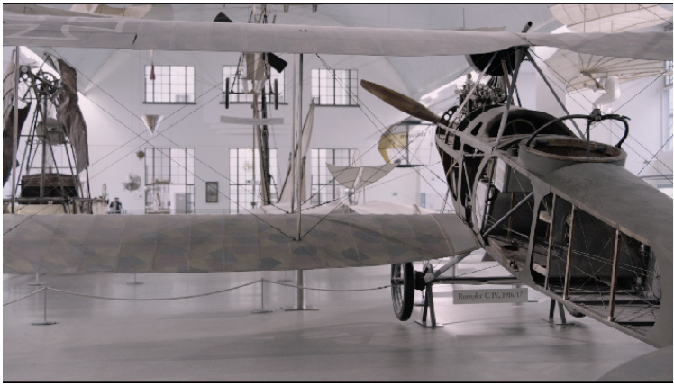
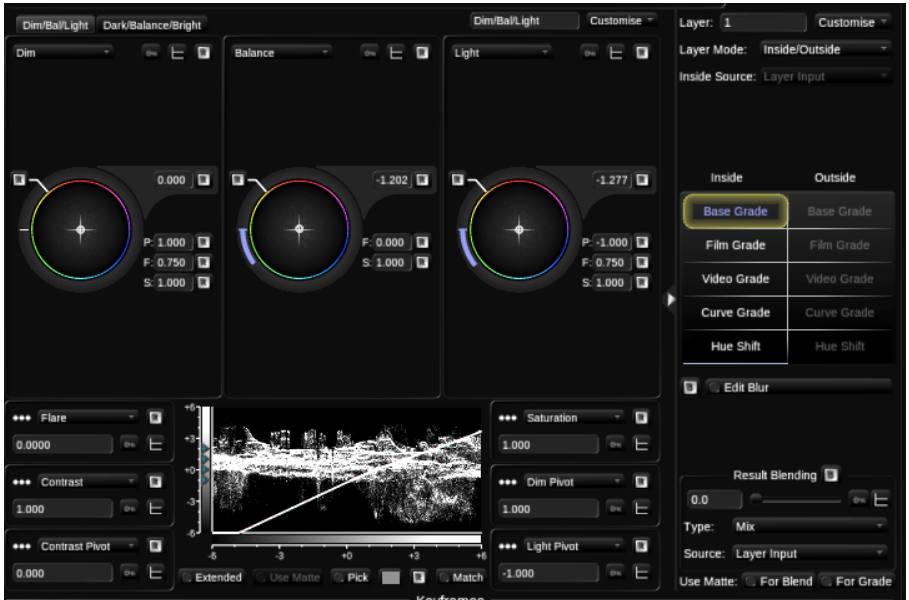

# Discovering the Base Grade ...... 43

Baselight v5 Training Manual

In the next part of this chapter we will look more closely at some of the features of Base Grade. You can complete this section even if you do not have a control surface attached to your machine.

Base Grade works in a perceptual colour space and operates in unit called T stops. \(T-stops, or “transmission stops” are exposure units on cinematographic lenses.\)

When we say that it works in a perceptual space, we mean that it works like the human eye. Brightness, for example will not fall off in a strictly linear way but rather in a way that mimics what happens to light striking the retina when the human iris contracts.

As mentioned previously, it is really important when working with Base Grade that the scene’s colour management is set correctly. So, your Input Colour Space must be correct \(remember Layer 0 is where you set the Input Colour Space\). Your Viewing Colour Space must also be correct \(i.e. it must match the native Colour Space of your monitor\).

If you have ProRes files with metadata intact, Baselight will automatically read that metadata. If metadata is detected, Baselight will set the input to Automatic so that Baselight automatically decodes the image Colour Space correctly.

Baselight v5 Training Manual

1. Return to the Aces scene. 2. Move to the shot that has the Base Grade applied and reset the changes you have made. You can do this by pressing Ctrl+Fn+Backspace on a Mac or Ctrl+Backspace on a Linux machine. 

3.On the Base Grade UI, you will see a luma waveform.

Baselight v5 Training Manual

Now your Scene is set up, we must set a third Colour Space. This is the Viewing Colour Space that we also sometimes call the Cursor Colour Space. We set a Viewing Colour Space so that your images are viewed correctly on your display. When we set the Viewing Colour Space we match it to the Colour Space of our viewing device. On monitors this is often Rec.709 or Rec.1886. And if we are using Baselight STUDENT on a Mac laptop, then this would be sRGB.

Move your cursor over the luma waveform on the Base Grade, you will see that it has a number of pivot overlays. You can think of the pivots as a way of separating the image into zones.

This means, for example, if you wanted to colour a very bright region of an image, you would set the Bright pivot to an appropriately high value. Prior to Base Grade, you may have used a key to get a similar effect.

So remember, one of the keys to using the Base Grade effectively is appropriately adjusting pivots. The highlights of the image are addressed with two sets of controls, Brights and Lights. And these areas are broken into zones via pivots.

Before we look at the pivots, lets simply change the brightness of the image via the Balance Control.

Remember we can liken Balance to the Exposure control in Film Grade. It lets you change the Brightness of the image and the White Balance of an image.

In the Balance control reduce the Brightness of the image. If you do not have a grading surface you can use the gestural controls that are supported in Baselight. To use it, simply click in the edit control and drag clockwise or anti-clockwise in a circular manner. Reduce the lights setting until you see more details in the wall area.

Baselight v5 Training Manual

You will see the changes that you make reflected on the luma graph. The images that we are using for this section are quite neutral so we don't need to affect the colour balance.

Baselight v5 Training Manual

Now let’s look at the Lights and Bright Settings. As the name suggests these controls allow you to alter the bright areas of an image.

By default, the Light control affects more of the image than the Bright control. This is because the Light Pivot is set to a lower value than the Bright Pivot. The Bright control and the Bright Pivot are set by default to deal with very Bright areas on a picture.

Baselight v5 Training Manual

Now find the Bright Parameter. Increase the setting so that you brighten the window. If you tried to re- peat the same action in Film Grade, things would be a little more complicated as Film Grade does not pro- vide you with the extra zones that you have available in Base Grade.

Similarly, you have two zones in Base Grade for the darker areas of the picture this is Darks and Dims. As with Brights and Lights - the effect lights and Darks will have on an image will be affected by where you have placed the Dark and Dim Pivots.

