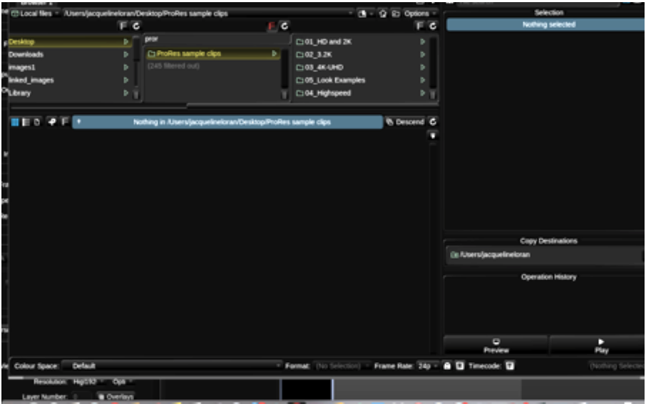
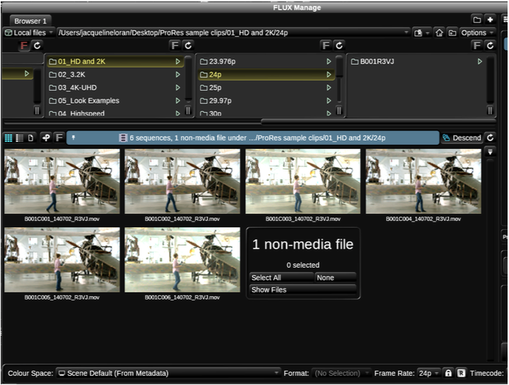
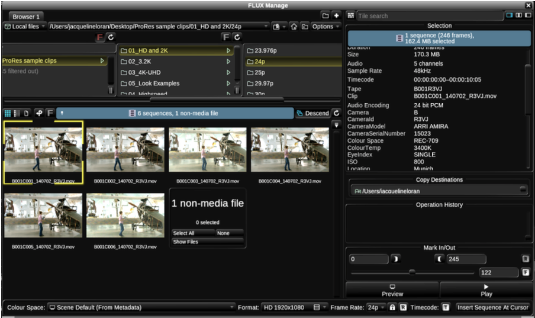
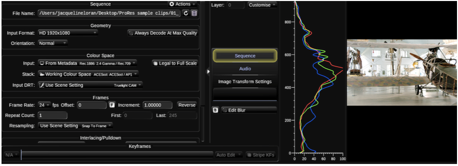
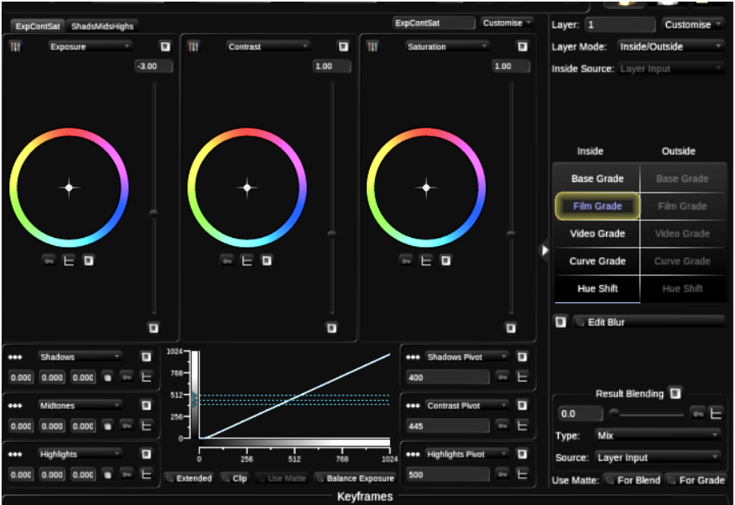

# Importing Shots from FLUX Manage and Copying Shots within a Timeline

Baselight v5 Training Manual

As you are now using Baselight V5, you will import clips into the scene via FLUX Manage. When you insert a clip, its head is aligned to the frame on which cursor rests in the timeline.

1. Go to the Views menu and open FLUX Manage.


Baselight v5 Training Manual

Please note that FLUX Manage has replaced the Sequence Browser that was available in 4.4m1. You can also make use of keyboard shortcuts to bring up FLUX Manage. On a Mac, press Ctrl+F. On a Linux system, press Win+F.

Also, if you don't like the layout of FLUX Manage, you can customise the panes. You will find splitter bars that you can drag around if you move your mouse over the interface.


Baselight v5 Training Manual

In FLUX Manage, navigate to the designated image directory. Click once to select the required clip and press Insert. \(Remember in FLUX Manage, if you want to view what is inside a folder you will have to press Descend.\)

Baselight v5 Training Manual

Also, please ensure that you are importing the clips using the correct Colour Space. In this section we are using Alexa ProRes images from the Amira camera. As there is metadata in the files, Baselight will correctly identify them on import.

Baselight v5 Training Manual

You can import the same clip twice. If you choose this method, make sure that after the first clip is inserted that you move the cursor to the end of the first clip before you insert the second clip \(Keys Z and X will move you backwards or forwards between clips.\)

If you prefer to duplicate a clip by copying, you will need to click to select the clip and press Ctrl+C. Then move the cursor to a new point in the timeline and press Ctrl+F.

In Baselight, we copy and paste sequences using the Ctrl+C and Ctrl+F combination. When you use Ctrl+F, make sure that nothing else is selected in the timeline.

If you mistakenly use Ctrl+V, you will find that it replaces anything that you have selected. So, keep this in mind. Use Ctrl+V only to replace.

As mentioned previously in order to navigate between different scenes, you can either press 1, 2 or 3 on your keyboard \(each corresponds to the cursor for each scene\). Or you can select the scene name on the top right of the user interface\).

Make sure that you have two clips in each scene. If you are following this example closely you should import a single clip from ‘o1\_HD and 2K/24p/01\_HD and 2K/24p/B001R3VJ/’ \(later we will import two more clips.\)

Remember the object of this exercise is to experiment with the feel of the Film Grade. We expect the Film Grade to feel slightly different in each scene with a different Working Colour Space.

You will then compare the feel of the Base Grade which should feel the same in each of the three scenes.

2.  In the Aces scene, select Film Grade and decrease exposure to about -3. Then decrease shadows. Pay particular attention to how the shadows are behaving.

3  Also, while exploring Film Grade, do keep in mind that the shadow region is defined by the position of the Shadow Pivot. By default, the Shadow Pivot is set to 400, so anything with a value of below 400 is affected when you change the shadow control. For the purposes of this example you do not need to change the Shadow Pivot.

4  Try the same action in the ARRI scene Using Film Grade, change the brightness of the image by decreasing exposure to -3. Next decrease the shadows.

5 Finally do the same in the RED scene. So, in Film Grade, reduce exposure and change shadows.

Baselight v5 Training Manual

As you grade in the different scenes, you will feel a slight difference in behaviour. You will of course only feel a difference if you are using a grading device with track balls.

If you want to view the output of scenes simultaneously, you can go to the Display menu and choose 3x1.

A rough equivalent to Film Grade’s Exposure is the Balance control in Base Grade.

6  Return to the ACES scene and move to the second shot by pressing X or by choosing the short forward button on your Slate or Blackboard.

7  Add a layer to the next shot \(by pressing P\). Select Base Grade, find the Balance Control and decrease the brightness with the UI slider or by rotating the corresponding ring on your control surface. As another option.

8  Next mimic the effect of changing shadows in Film Grade by reducing Dims in Base Grade.

9  Now repeat the above in the ARII and RED scenes.  
 Remember Base Grade works internally in its own colour space so it will not be affected by the working colour space of your scene. The controls should feel the same regardless.

10  Spend a few minutes exploring and comparing the differences between the Film Grade and Base Grade

