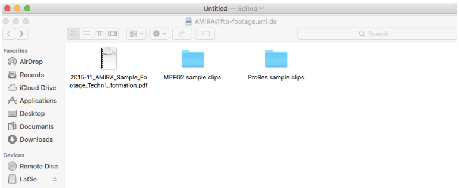
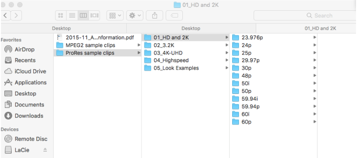

# Setting Up

The Different Baselight Grading Tools

This section will introduce you to the differences between:

* Film Grade
* Video Grade
* Base Grade

* * Setting Up

The material that we discuss in this section may already be available on your training machine and the scenes for the exercise may already be created.

Your trainer will inform you if you already have the correct material – if you do please jump to the section which starts Why does Baselight have so many different grading tools?

Otherwise you can obtain the relevant material through the following instructions.

1  Access the server below using these details. Server: ftp-footage.arri.de

User: AMIRA Password: samplefootage

2  In a web browser, type in the following:

http://www.arri.com/camera/alexa/learn/alexa\_sample\_footage/

3  Find the ftp link for the AMIRA footage on this page.

4  When you click on the ftp link, a window will open in which you will be able to navigate to the ProRes sample clips.

This first part of this tutorial is based around the ProRes sample clips in the folder called ‘01\_HD and 2k/24p’.

5 Please navigate to ‘01\_HD and 2K/24p/B001R3VJ/’ and download the file called ‘B001C001\_140702\_R3VJ.mov’ to your laptop. If you wish to, you can recreate the folder hierarchy shown below, or simply drop the file in a folder of your choosing.

Also, if you don’t wish to download the files, feel free to experiment using your own material. If you do use your own images, you will need well-exposed pictures with varied tonal regions.

